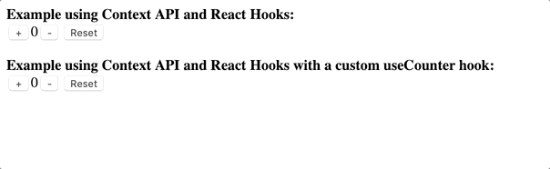

# Welcome

This project is meant to serve as a starting point for exploring [React](https://reactjs.org) using [Docker](https://www.docker.com).

## Initial setup

### Docker

The easiest way to use this repo is to have [Docker Desktop](https://www.docker.com/products/docker-desktop) installed and configured on your development machine.

### Development environment

Once you have Docker installed, verify that you have a recent version of [Node.js](https://nodejs.org/en/) and npm installed on your development machine:

```sh
# Verify that you have Node.js v10.9.0 or later installed (https://nodejs.org)
$ node -v
v12.13.1

# Verify that the npm package manager has been installed
$ npm -v
6.13.3
```

## Examples

### Example 01 - Flag cards with React Hooks best practices


### Example 02 - Use of the Context API and React Hooks



### Example 03 - Experimental build with concurrent mode enabled

Check out `examples/create-react-app-example-03-experimental-build-with-concurrent-mode-enabled/src/index.js` to see how concurrent mode can be enabled to dynamically load (and optionally unmount) React apps from the DOM.

```js
// Current release of React (which does not have support for concurrent mode)
// ReactDOM.render(<App />, document.getElementById('root'));

// If we have react@experimental and react-dom@experimental, we can enable concurrent mode
const rootEl = document.getElementById('root');
const root = ReactDOM.createRoot(rootEl);
root.render(<App />);

// // We can use another root API to automatically unmount our app after a delay
// setTimeout(() => {
//   root.unmount()  // Presto! Our app is unmounted after three seconds 🎩
// }, 3000);
```

### Add an example

Please see `examples/README.md` for specific details about adding new examples to the project.
